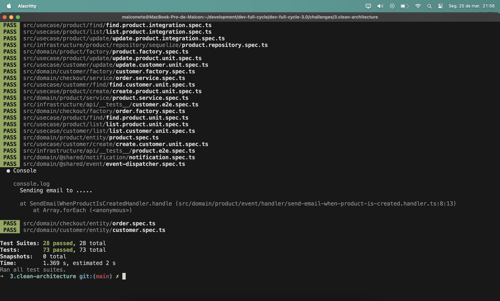

# dev-full-cycle-3.0

My "dev-full-cycle-3.0" journey

## Table of Content

## Desafio Use Cases para Product

Da mesma forma que fizemos a criação dos use cases realizando as operações: "create", "find", "list", "update" para "Customer", faça:

Crie as operações mencionadas acima para nossa entidade: "Product".
Implemente os testes de unidade e integração nos quatro use cases.

* A linguagem de programação para este desafio é TypeScript

## Notification Pattern em Products

Aprendemos que o notification pattern nos auxilia como um container acumulador de erros para que possamos de uma forma mais simples retornarmos nossos erros todos de uma vez evitando assim a geração excessiva de exceções.

Nesse desafio você deverá utilizar o padrão notification em nossa entidade Products. Não deixe de realizar os testes automatizados.

Adicione um teste que acumule dois erros ao mesmo tempo.

* A linguagem de programação para este desafio é TypeScript

