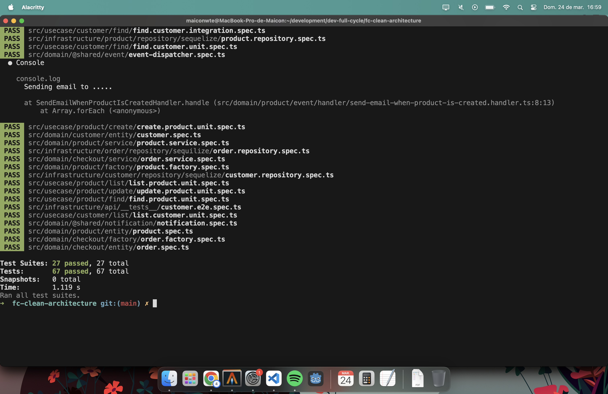

## Desafio Use Cases para Product

Da mesma forma que fizemos a criação dos use cases realizando as operações: "create", "find", "list", "update" para "Customer", faça:

Crie as operações mencionadas acima para nossa entidade: "Product".
Implemente os testes de unidade e integração nos quatro use cases.

* A linguagem de programação para este desafio é TypeScript

